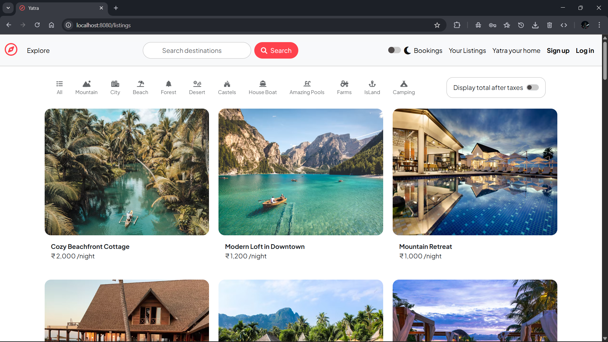
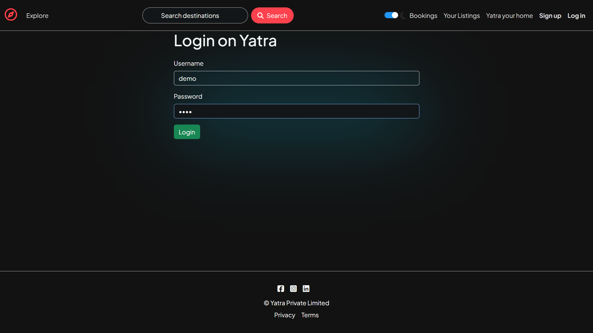
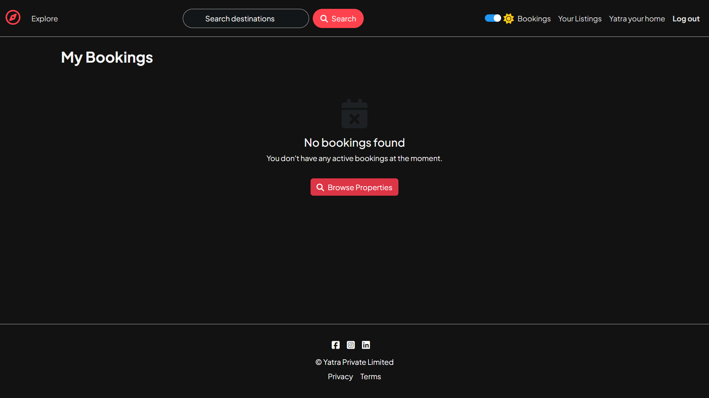
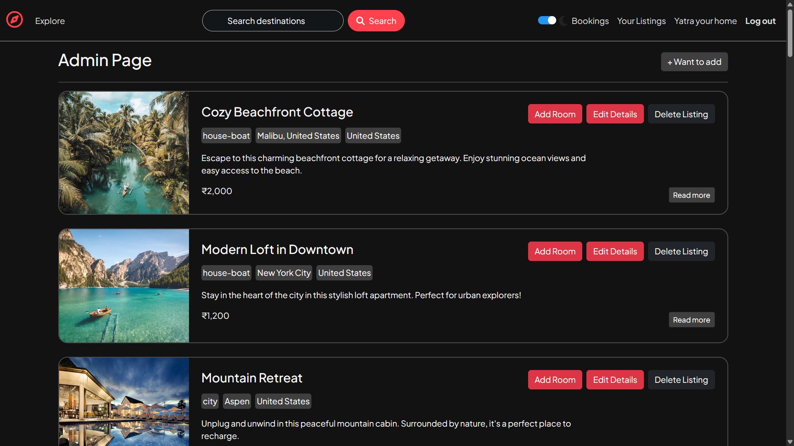
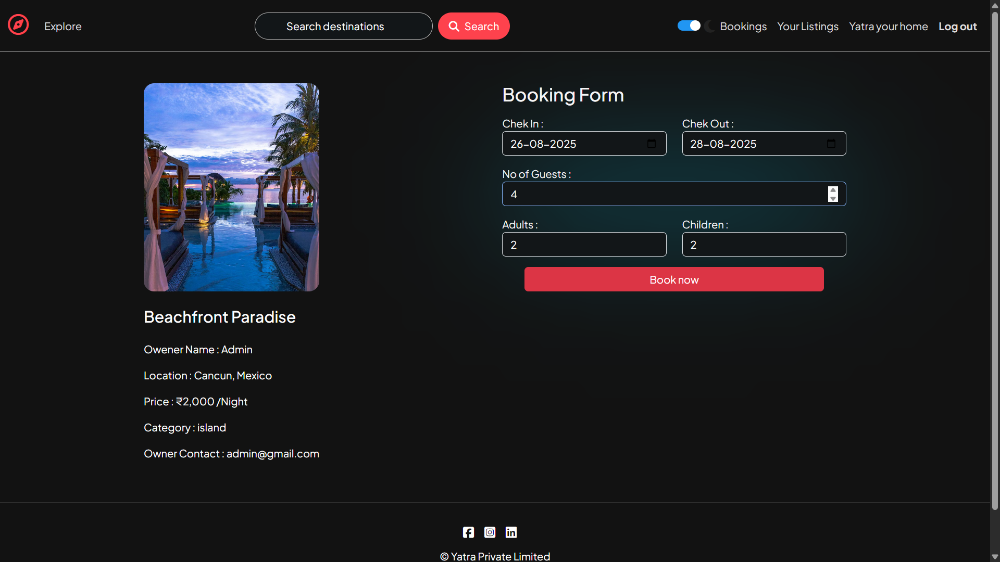
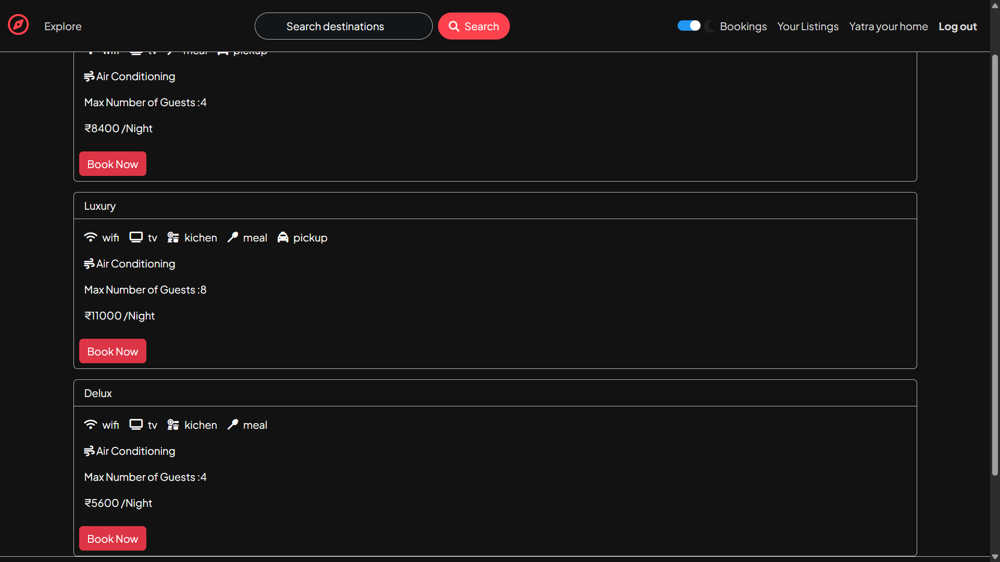
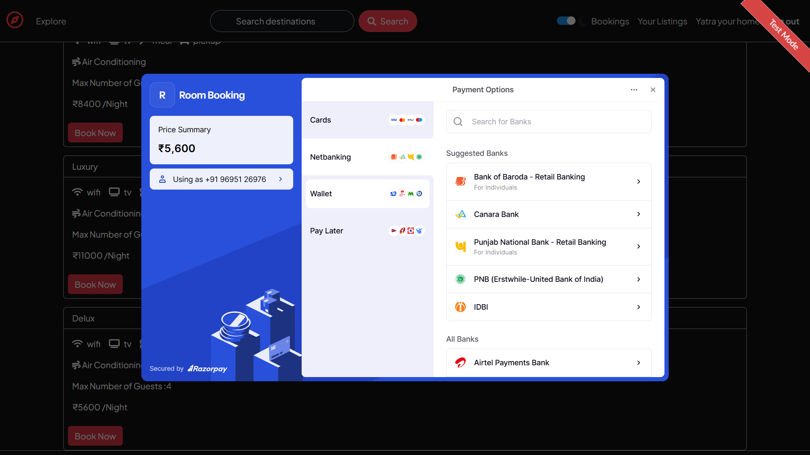

# 🏡 Yatra – Airbnb Clone

**Yatra** is a full-stack web application inspired by [Airbnb](https://www.airbnb.com/). It allows users to **explore, book, and manage accommodations**, with features like **interactive maps, advanced filters, secure payments, and responsive design**.

Built using the **MVC architecture**, Yatra is designed to replicate core Airbnb functionality while serving as a learning project to strengthen full-stack web development skills.

---

## 📌 Features

- 🏘️ **Browse Listings** – View all property listings with images, price, and location.
- 🔐 **User Authentication** – Register, Login, and Logout securely with Passport.js.
- ➕ **Add New Listings** – Create listings with images, pricing, description, and location.
- ✏️ **Manage Listings** – Edit and delete your own listings.
- 📝 **Reviews** – Add and delete reviews on listings.
- 📁 **Image Uploads** – Cloud storage using **Cloudinary** and upload handling with **Multer**.
- 🗺️ **Map Integration** – Interactive maps with **Mapbox** to display and search listings by location.
- 🔍 **Filters** – Filter listings by category.
- 📱 **Responsive Design** – Fully optimized for desktop and mobile.
- 📅 **Booking System** – Reserve rooms with check-in/out dates and guest details.
- 💳 **Payment Integration** – Secure payments using **Razorpay**.
- ✅ **Error Handling & Flash Messages** – Friendly UI for errors and notifications.

---

## 🛠 Tech Stack

### 🚀 Frontend

- HTML, CSS, Bootstrap
- JavaScript
- EJS (Embedded JavaScript Templates)

### 🧠 Backend

- Node.js & Express.js
- MongoDB with Mongoose ODM
- Passport.js (Authentication)
- Cloudinary (Image Storage)
- Multer (Upload Middleware)
- Mapbox (Map & Geolocation)
- Razorpay (Payment Gateway)

---

## 📸 Screenshots

### Home Page




### Listings Page







### Booking & Payment





---

## 💡 Future Improvements

- 🌍 **Internationalization (i18n)** – Multi-language support.
- 📨 **Email Notifications** – Booking and payment confirmations via email.
- ⭐ **Wishlist / Favorites** – Save favorite listings for later.
- 📊 **Admin Dashboard** – Manage users, bookings, and revenue analytics.

---

## 🧑‍🎓 About the Author

**Parikshit Pandey**  
B.Tech CSE – United Institute of Technology  
3rd year Student

---

## 🧪 Setup Instructions

1. **Clone the repository**

   ```bash
   git clone https://github.com/Parikshit05/Yatra.git

   ```

2. **Install dependencies**
   ```bash
   npm install
   
   ```

3. **Set up environment variables in .env**
   ```CLOUDINARY_CLOUD_NAME=your_cloud_name```
   ```CLOUDINARY_KEY=your_api_key```
   ```CLOUDINARY_SECRET=your_api_secret```
   ```ATLASDB_URL=```
   ```SECRET=```
   ```RAZORPAY_KEY_ID=your_razorpay_key```
   ```RAZORPAY_KEY_SECRET=your_razorpay_secret```

4. **Run the server**
   ```bash
   node app.js

   ```

   **or**
   ```bash 
   nodemon app.js

   ```

# 📃 License
This project is for educational purposes only and not intended for commercial use
